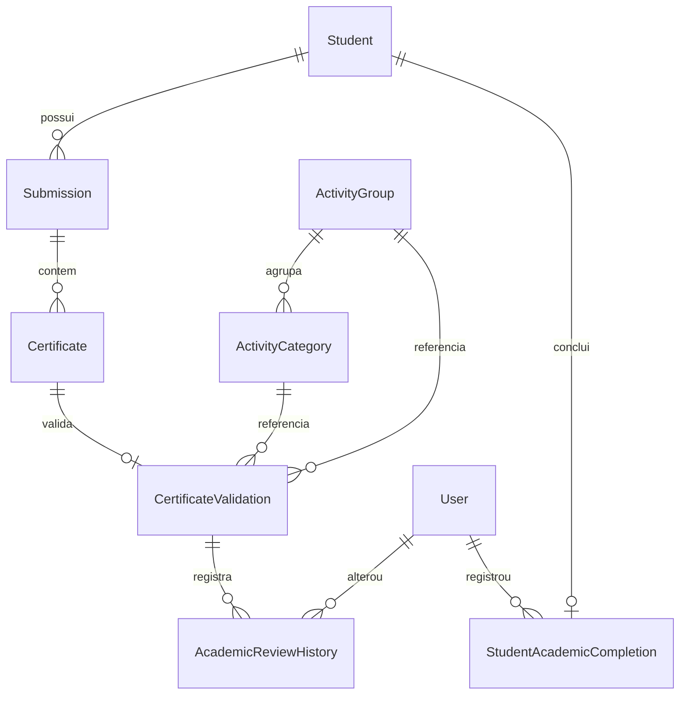
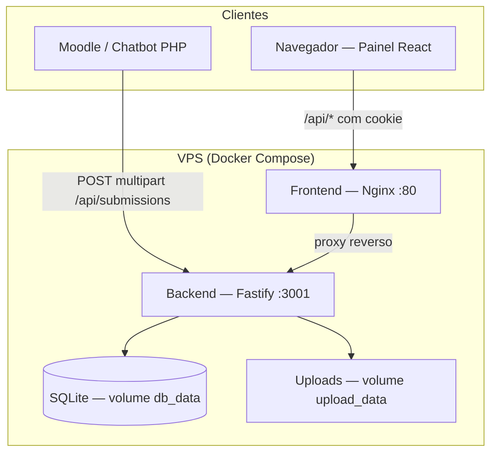

# Documentação de Entregas — Projeto TIC+AC (ValidaCert)

**Projeto:** Plataforma de validação de atividades complementares (chatbot + painel web)  
**Repositório:** Chatbot certificados / ValidaCert  
**Última atualização:** 23/06/2026

---

## 1. Contexto e objetivos

O projeto TIC+AC tem como objetivo geral **desenvolver a plataforma TIC+AC** para recebimento, armazenamento e análise de submissões de atividades complementares, integrando o chatbot (Moodle) ao backend e oferecendo um painel web para o orientador.

Um segundo eixo de trabalho relaciona-se ao objetivo **"Realizar testes da plataforma com estudantes do curso, coletando sugestões e feedback para aprimoramento da solução"**, abrangendo apoio ao desenvolvimento da interface, planejamento e execução de testes de usabilidade e documentação dos resultados.

Este documento consolida as entregas previstas nesses dois eixos, com base no estado atual do repositório.

---

## 2. Desenvolvimento Backend

As entregas de backend concentram-se na implementação de APIs, modelagem e população do banco de dados, testes técnicos e documentação do sistema.

### 2.1. APIs para comunicação com o chatbot

#### 2.1.1. Visão geral

A integração com o chatbot/Moodle ocorre por meio de uma **API REST** implementada em **Node.js (Fastify 5) + TypeScript**. O endpoint principal de entrada é público (sem sessão), permitindo que o chatbot envie submissões via `multipart/form-data`.

Documentação complementar:

- [`backend/README.md`](../backend/README.md) — contrato completo dos endpoints
- [`docs/INTEGRACAO-CHATBOT.md`](INTEGRACAO-CHATBOT.md) — guia de integração para o time do chatbot

#### 2.1.2. Endpoint principal (chatbot → backend)

| Método | Rota | Autenticação | Descrição |
|--------|------|--------------|-----------|
| `POST` | `/api/submissions` | Nenhuma (público) | Recebe requerimento + certificados em PDF via multipart |

**Resposta de sucesso (`201`):**

```json
{
  "success": true,
  "submissionId": "<uuid>"
}
```

**Resposta de erro (`4xx` / `5xx`):**

```json
{
  "success": false,
  "message": "..."
}
```

#### 2.1.3. Contrato multipart (`POST /api/submissions`)

**Campos texto obrigatórios:**

| Campo | Tipo | Descrição |
|-------|------|-----------|
| `aluno_matricula` | string | Matrícula do aluno |
| `aluno_nome` | string | Nome completo |
| `aluno_email` | string | E-mail institucional |
| `total_certificados` | inteiro ≥ 0 | Quantidade de certificados enviados |

**Campo opcional:**

| Campo | Descrição |
|-------|-----------|
| `aluno_id` | ID externo (Moodle); se omitido, usa-se a matrícula como `externalUserId` |

**Arquivo obrigatório:**

| Campo | Descrição |
|-------|-----------|
| `requerimento` | PDF do requerimento de atividades complementares |

**Para cada certificado (índice `i` de `0` a `total_certificados - 1`):**

| Campo | Descrição |
|-------|-----------|
| `cert_{i}_grupo` | Texto do grupo/categoria (mapeado para catálogo UFSC) |
| `cert_{i}_horas` | Horas declaradas (número ≥ 0; vírgula ou ponto) |
| `cert_{i}_arquivo` | Arquivo PDF do certificado |

**Limites de upload:**

- Até **25 MB** por arquivo
- Até **50** arquivos por requisição

**Armazenamento:**

- Requerimentos: `UPLOAD_DIR/requerimentos/{submissionId}/`
- Certificados: `UPLOAD_DIR/certificados/{submissionId}/`
- Nomes seguros no disco (UUID + extensão); nome original preservado no banco

#### 2.1.4. Demais endpoints da API

##### Endpoints públicos

| Método | Rota | Descrição |
|--------|------|-----------|
| `GET` | `/health` | Health check (`{ "status": "ok" }`) |
| `POST` | `/api/submissions` | Nova submissão (chatbot) |

##### Autenticação (painel web)

| Método | Rota | Descrição |
|--------|------|-----------|
| `POST` | `/api/auth/login` | Login do orientador (cookie HttpOnly) |
| `GET` | `/api/auth/me` | Dados da sessão atual |
| `POST` | `/api/auth/logout` | Encerramento de sessão |

##### Submissões (painel — autenticado)

| Método | Rota | Descrição |
|--------|------|-----------|
| `GET` | `/api/submissions` | Lista paginada (`skip`, `take`; máx. 100) |
| `GET` | `/api/submissions/:id` | Detalhe com aluno e certificados |
| `PATCH` | `/api/submissions/:id/status` | Altera status operacional (`pending` \| `approved` \| `rejected`) |

##### Alunos (painel — autenticado)

| Método | Rota | Descrição |
|--------|------|-----------|
| `GET` | `/api/students` | Lista de alunos (com overview opcional) |
| `GET` | `/api/students/:id` | Aluno com submissões e certificados |
| `GET` | `/api/students/:id/academic-summary` | Consolidação acadêmica + elegibilidade normativa |
| `GET` | `/api/students/:id/consolidated-report.pdf` | Relatório PDF consolidado (download) |
| `GET` | `/api/students/:id/academic-completion` | Conclusão oficial das atividades |
| `POST` | `/api/students/:id/academic-completion` | Registrar conclusão (exige aptidão normativa) |
| `POST` | `/api/students/:id/academic-completion/revoke` | Revogar conclusão |

##### Certificados (painel — autenticado)

| Método | Rota | Descrição |
|--------|------|-----------|
| `PATCH` | `/api/certificates/:id/academic-review` | Revisão acadêmica (status, horas, parecer) |
| `PATCH` | `/api/certificates/:id/academic-classification` | Reclassificação de grupo/categoria |
| `GET` | `/api/certificates/:id/academic-review/history` | Histórico de transições da revisão |

##### Catálogo e arquivos (painel — autenticado)

| Método | Rota | Descrição |
|--------|------|-----------|
| `GET` | `/api/academic-catalog` | Grupos (GI–GV) e categorias com regras |
| `GET` | `/api/files/*` | Stream autenticado de PDFs (requerimentos/certificados) |

#### 2.1.5. Checklist de integração chatbot

- [ ] Mesmos nomes de campo que o `CURLFile` / `post_data` do Moodle
- [ ] `total_certificados` igual à quantidade de índices `0..n-1` enviados
- [ ] Content-Type: `multipart/form-data` (boundary automático)
- [ ] Tamanho máximo alinhado ao PHP (`upload_max_filesize`, `post_max_size`) e ao Fastify (25 MB)
- [ ] URL base do backend acessível a partir do servidor Moodle (rede e firewall)

#### 2.1.6. Exemplo de teste (curl)

```bash
curl -s -X POST http://127.0.0.1:3000/api/submissions \
  -F "aluno_matricula=2025123456" \
  -F "aluno_nome=Nome Sobrenome" \
  -F "aluno_email=aluno@ufsc.br" \
  -F "total_certificados=1" \
  -F "requerimento=@/caminho/requerimento.pdf" \
  -F "cert_0_grupo=Extensao" \
  -F "cert_0_horas=10" \
  -F "cert_0_arquivo=@/caminho/certificado.pdf"
```

---

### 2.2. Banco de dados estruturado e populado

#### 2.2.1. Tecnologias

| Componente | Tecnologia |
|------------|------------|
| ORM | Prisma 5.x |
| SGBD | SQLite (dev/demo); volume persistente em produção (Docker) |
| Migrações | `backend/prisma/migrations/` |
| Seed | `backend/prisma/seed.ts` (`npm run db:seed`) |

#### 2.2.2. Modelo de dados

##### Entidades operacionais

| Modelo | Descrição |
|--------|-----------|
| `User` | Orientador (login, senha bcrypt, papel `advisor`) |
| `Student` | Aluno (`matricula`, `nome`, `email`, `externalUserId`) |
| `Submission` | Submissão (`status`, caminho do requerimento) |
| `Certificate` | Certificado por submissão (`grupo`, `horas`, `approvalStatus` operacional) |

##### Domínio acadêmico UFSC

| Modelo | Descrição |
|--------|-----------|
| `ActivityGroup` | Grupos oficiais GI–GV (mínimo 20 h por grupo) |
| `ActivityCategory` | Categorias por grupo (`maxHours`, `maxEligibleHours`, `ruleNotes`) |
| `CertificateValidation` | Validação acadêmica 1:1 com certificado (`status`, `approvedHours`, parecer) |
| `AcademicReviewHistory` | Log append-only de transições na revisão acadêmica |
| `StudentAcademicCompletion` | Decisão administrativa de conclusão (1 registro por aluno) |

##### Diagrama simplificado de relacionamentos



#### 2.2.3. Regras das atividades complementares cadastradas

As regras normativas UFSC estão modeladas no catálogo acadêmico:

**Constantes globais** ([`backend/src/domain/academicRules.ts`](../backend/src/domain/academicRules.ts)):

| Regra | Valor |
|-------|-------|
| Horas totais elegíveis mínimas | 144 h |
| Grupos distintos validados mínimos | 3 |
| Horas mínimas por grupo | 20 h |

**Grupos cadastrados (GI–GV):**

| Código | Nome |
|--------|------|
| GI | Grupo I — Docência e pesquisa |
| GII | Grupo II — Eventos e atividades assistidas |
| GIII | Grupo III — Publicações científicas |
| GIV | Grupo IV — Vivência profissional |
| GV | Grupo V — Formação complementar |

**Categorias (exemplos com tetos elegíveis):**

| Grupo | Categoria | Teto elegível (`maxEligibleHours`) |
|-------|-----------|-------------------------------------|
| GII | Congressos e similares | 30 h |
| GII | Seminários, simpósios e defesas | 15 h |
| GIII | Publicações científicas | conforme regulamento |
| GV | Demais atividades | conforme regulamento |

Cada categoria inclui `ruleNotes` com orientações textuais do regulamento (ex.: "2 h por palestra; máximo 10 h").

#### 2.2.4. População do banco (seed)

O comando `npm run db:seed` (em `backend/`) recria:

- Usuário demo: **orientador** / **orientador123** (ou **Vilson** / **1234** conforme ambiente)
- 4 alunos de demonstração com submissões em estados variados (pendente, aprovada, rejeitada)
- Certificados com validações acadêmicas para smoke test de consolidação
- PDFs mínimos em `UPLOAD_DIR` para teste de visualização

**Cenários de consolidação após seed:**

| Aluno | Cenário |
|-------|---------|
| Bruno Costa | 144 h elegíveis, 3 grupos validados → `academicEligibility.status: apto` |
| Daniel Lima | Grupo GII abaixo de 20 h elegíveis → `nao_apto` |

**Atenção:** o seed é destrutivo — usar apenas em desenvolvimento ou demos controladas.

#### 2.2.5. Comandos de banco

```bash
cd backend
npm install
npx prisma migrate dev    # aplicar migrações (dev)
npx prisma migrate deploy # aplicar migrações (CI/prod)
npm run db:seed           # popular dados de demonstração
npm run db:studio         # interface visual (Prisma Studio)
```

---

### 2.3. Testes técnicos da aplicação

#### 2.3.1. Testes automatizados (integração)

Os testes de integração rodam com o runner nativo do Node.js (`node:test`) via:

```bash
cd backend
npm test
```

**Suíte de testes implementada:**

| Arquivo | Escopo |
|---------|--------|
| `academicCatalog.test.ts` | `GET /api/academic-catalog`, overview de alunos |
| `academicCompletion.test.ts` | Conclusão oficial (`POST/GET .../academic-completion`, revoke) |
| `academicEligibility.test.ts` | Regras de aptidão normativa (144 h, 3 grupos, 20 h/grupo) |
| `academicRejectionEmail.test.ts` | Contrato de rejeição, conteúdo de e-mail, PATCH com notificação |
| `certificateReassign.test.ts` | Reclassificação de grupo/categoria |
| `consolidated-report.test.ts` | `GET .../consolidated-report.pdf` (status, content-type) |
| `consolidatedReportViewModel.test.ts` | View model do relatório PDF |
| `renderConsolidatedReportPdf.test.ts` | Geração do PDF consolidado |

**Infraestrutura de teste:**

- [`backend/test/buildTestApp.ts`](../backend/test/buildTestApp.ts) — monta app Fastify isolado para testes HTTP
- Banco SQLite em memória ou temporário por suíte
- `MAIL_ENABLED=false` por padrão nos testes (sem envio real de e-mail)

#### 2.3.2. Testes manuais pós-deploy

Checklist documentado em [`docs/DEPLOY-CHECKLIST.md`](DEPLOY-CHECKLIST.md):

- [ ] Login e logout
- [ ] Dashboard: alunos, submissões, regras dos grupos
- [ ] Perfil do aluno: 5 grupos, resumo, conclusão oficial
- [ ] Detalhe de submissão: certificados agrupados por grupo/categoria
- [ ] Revisão acadêmica (aprovar/rejeitar com parecer)
- [ ] Pré-visualizar e baixar relatório consolidado (PDF)
- [ ] Perfil do orientador (`/profile`)
- [ ] SMTP (se `MAIL_ENABLED=true`): rejeição envia notificação

#### 2.3.3. Testes de carga

**Status:** não automatizados no repositório.

**Recomendações para execução:**

| Cenário | Métrica alvo | Ferramenta sugerida |
|---------|--------------|---------------------|
| `POST /api/submissions` com 1–5 certificados | Tempo de resposta < 5 s (p95) | k6, Apache Bench ou Artillery |
| `GET /api/students/:id/academic-summary` | Tempo de resposta < 500 ms (p95) | k6 |
| Upload simultâneo (10 requisições) | Sem erro 5xx | k6 |

**Limitações conhecidas para carga:**

- Sessão in-memory (não compartilhada entre instâncias)
- SQLite (concorrência de escrita limitada)
- Upload em disco local

#### 2.3.4. Testes de segurança

**Medidas implementadas:**

| Aspecto | Implementação |
|---------|---------------|
| Autenticação do painel | Sessão server-side + cookie HttpOnly (`SameSite=Lax`, `Secure` em produção) |
| Rotas protegidas | Hook `onRequest` em [`protected/index.ts`](../backend/src/routes/protected/index.ts) |
| Endpoint público | Apenas `POST /api/submissions` e `/health` |
| Arquivos | `GET /api/files/*` exige sessão; prefixos restritos (`requerimentos/`, `certificados/`) |
| Senhas | bcrypt no cadastro de usuários |
| Logs em produção | Valores de submissão não logados por padrão (`NODE_ENV=production`) |
| CORS | Origem explícita com `credentials: true` |

**Verificações de segurança recomendadas (checklist):**

- [ ] Tentativa de acesso a `/api/students` sem cookie → `401`
- [ ] Tentativa de path traversal em `/api/files/` → rejeição
- [ ] `POST /api/submissions` com campos malformados → `400` com mensagem clara
- [ ] Rejeição acadêmica sem parecer → `400`
- [ ] Exposição do backend apenas em rede controlada ou com proxy reverso (VPS)

**Pendências de segurança (backlog):**

- API key ou token para `POST /api/submissions` (hoje público para integração Moodle)
- RBAC (qualquer usuário logado acessa todo o painel)
- Validação estrita de tipo MIME (apenas PDF) nos uploads

---

### 2.4. Documentação técnica completa do sistema

#### 2.4.1. Arquitetura



**Stack tecnológica:**

| Camada | Tecnologias |
|--------|-------------|
| Backend | Node.js 20+, Fastify 5, TypeScript, Prisma 5, SQLite |
| Frontend | React 19, Vite 8, Tailwind CSS 4, React Router 7 |
| Infra | Docker Compose, Nginx (frontend), volumes persistentes |
| E-mail | Nodemailer (opcional, Fase 11) |
| PDF | PDFKit (relatório consolidado) |

#### 2.4.2. Estrutura do repositório

| Pasta | Conteúdo |
|-------|----------|
| `backend/src/routes/` | Rotas HTTP (públicas e protegidas) |
| `backend/src/services/` | Lógica de negócio (submissões, consolidação, auth) |
| `backend/src/domain/` | Regras UFSC, catálogo, contratos de validação |
| `backend/src/modules/email/` | Envio de e-mail de rejeição acadêmica |
| `backend/src/pdf/` | Renderização do relatório consolidado |
| `backend/prisma/` | Schema, migrações e seed |
| `backend/test/` | Testes automatizados |
| `frontend/src/pages/` | Páginas do painel |
| `frontend/src/components/` | Componentes reutilizáveis |
| `frontend/src/services/api.ts` | Cliente HTTP da API |
| `docs/` | Documentação de integração, deploy e entregas |

#### 2.4.3. Fluxos de dados principais

##### Fluxo 1 — Submissão via chatbot

1. Aluno envia documentos pelo chatbot/Moodle
2. Chatbot monta `multipart/form-data` conforme contrato
3. `POST /api/submissions` persiste aluno (upsert), submissão, certificados e arquivos
4. Sistema cria `CertificateValidation` com status `pending` e mapeia grupo/categoria
5. Resposta retorna `submissionId` para rastreamento

##### Fluxo 2 — Revisão acadêmica (painel)

1. Orientador autentica-se (`POST /api/auth/login`)
2. Acessa submissão ou perfil do aluno
3. `PATCH /api/certificates/:id/academic-review` altera status, horas aprovadas e parecer
4. Histórico gravado em `AcademicReviewHistory` (transação atômica)
5. Se rejeição: e-mail opcional via SMTP (best-effort, pós-commit)
6. `GET /api/students/:id/academic-summary` recalcula consolidação on-demand

##### Fluxo 3 — Conclusão oficial

1. Sistema verifica `academicEligibility.status === 'apto'`
2. `POST /api/students/:id/academic-completion` persiste snapshot e data
3. Revogação manual via `POST .../revoke` quando necessário

#### 2.4.4. Variáveis de ambiente

| Variável | Descrição | Padrão dev |
|----------|-----------|------------|
| `DATABASE_URL` | Caminho do SQLite | `file:./dev.db` |
| `PORT` | Porta do backend | `3000` |
| `UPLOAD_DIR` | Pasta de uploads | `./uploads` |
| `SESSION_SECRET` | Assinatura do cookie (mín. 16 chars) | obrigatório |
| `CORS_ORIGIN` | Origem do frontend | `http://localhost:5173` |
| `MAIL_ENABLED` | Ativa envio de e-mail | `false` |
| `SMTP_*` | Configuração SMTP | — |

Ver [`backend/.env.example`](../backend/.env.example) para lista completa.

#### 2.4.5. Instruções para manutenção futura

**Desenvolvimento local:**

```bash
# Backend
cd backend && cp .env.example .env
npm install && npx prisma migrate dev
npm run db:seed   # opcional
npm run dev

# Frontend (outro terminal)
cd frontend && npm install && npm run dev
```

Ou usar `iniciar.bat` na raiz (Windows).

**Deploy (VPS):**

1. Enviar código para `/opt/validacert-dev` ou `/opt/validacert`
2. Configurar `.env` (CORS, SESSION_SECRET, DATABASE_URL)
3. `docker compose up -d --build`
4. Executar checklist em [`docs/DEPLOY-CHECKLIST.md`](DEPLOY-CHECKLIST.md)

**Alteração de regras acadêmicas:**

1. Atualizar `ActivityCategory` no banco (migration ou seed)
2. Revisar constantes em `academicRules.ts` se limiares globais mudarem
3. Rodar `npm test` para validar consolidação e elegibilidade
4. Atualizar documentação e frontend (catálogo exibido no dashboard)

**Reparo de inconsistências (dev):**

```bash
npm run repair-academic
```

Normaliza combinações inválidas de `status`/`approvedHours` e grava histórico com `source=repair_script`.

**Limitações operacionais:**

| Comportamento | Causa |
|---------------|-------|
| Restart do backend desloga todos | Store in-memory de sessão |
| Múltiplas instâncias não compartilham sessão | Sem Redis/DB store |
| Consolidação recalculada a cada GET | Sem cache persistido |

#### 2.4.6. Documentos relacionados

| Documento | Conteúdo |
|-----------|----------|
| [`README.md`](../README.md) | Visão geral, estado funcional, changelog |
| [`backend/README.md`](../backend/README.md) | Endpoints, domínio acadêmico, seed, testes manuais |
| [`docs/INTEGRACAO-CHATBOT.md`](INTEGRACAO-CHATBOT.md) | Integração chatbot/Moodle |
| [`docs/DEPLOY-CHECKLIST.md`](DEPLOY-CHECKLIST.md) | Deploy e testes pós-deploy na VPS |

---

## 3. Testes com usuários e usabilidade

As entregas desta seção relacionam-se ao objetivo de **realizar testes da plataforma com estudantes do curso**, coletando feedback para aprimoramento da solução.

### 3.1. Apoio no desenvolvimento da plataforma (interface e navegação)

#### 3.1.1. Painel web implementado

SPA React com as seguintes rotas:

| Rota | Página | Função |
|------|--------|--------|
| `/login` | Login | Autenticação do orientador |
| `/` | Dashboard | Visão híbrida: submissões, alunos, regras GI–GV |
| `/students` | Lista de alunos | Navegação para perfis |
| `/students/:id` | Perfil do aluno | 5 grupos, resumo acadêmico, conclusão, PDF |
| `/submission/:id` | Detalhe da submissão | Certificados agrupados, revisão operacional e acadêmica |
| `/profile` | Perfil do orientador | Dados da sessão |

#### 3.1.2. Componentes de interface relevantes

| Componente | Responsabilidade |
|------------|------------------|
| `Layout`, `Sidebar`, `Header` | Estrutura e navegação global |
| `SubmissionDetailContent` | Detalhe de submissão, aprovação por arquivo |
| `GroupedCertificatesList` | Agrupamento visual por grupo/categoria |
| `AcademicReviewForm` | Formulário de revisão acadêmica por certificado |
| `AcademicSummaryCard` | Exibição de elegibilidade normativa |
| `AcademicReviewHistoryPanel` | Histórico de alterações |
| `PdfViewerModal` | Visualização de PDFs (iframe, timeout 15 s) |
| `CertificateReassignForm` | Reclassificação de grupo/categoria |
| `AcademicCatalogPanel` | Exibição das regras do catálogo |

#### 3.1.3. Decisões de UX adotadas

- Separação visual entre aprovação **operacional** (arquivo) e **acadêmica** (normativa)
- Frontend **não recalcula** elegibilidade — exibe dados de `academicEligibility` da API
- Reidratação automática após revisão acadêmica (sem refresh manual)
- Distinção visual entre **Requerimento** e **Certificado** nos documentos
- Feedback efêmero após rejeição acadêmica (notificação de e-mail)

---

### 3.2. Plano de testes de usabilidade

#### 3.2.1. Objetivo

Avaliar a experiência de uso do painel ValidaCert por orientadores e, quando aplicável, fluxo percebido pelos alunos (via chatbot), identificando barreiras de interface e navegação.

#### 3.2.2. Público-alvo

| Perfil | Quantidade sugerida | Critério de seleção |
|--------|---------------------|---------------------|
| Orientador / professor | 2–3 | Usuários que validam atividades complementares |
| Estudante (5ª fase TIC) | 4–6 | Alunos com experiência em submissão de certificados |
| Observador | 1 | Registro de tarefas e métricas |

#### 3.2.3. Ambiente e equipamento

- Navegador: Chrome ou Edge (versão atual)
- Resolução: 1366×768 (notebook) e 1920×1080 (monitor)
- Ambiente: instância dev na VPS (`:8083`) ou local com seed
- Credenciais demo: orientador conforme seed do backend

#### 3.2.4. Cenários e tarefas

| ID | Cenário | Tarefa | Critério de sucesso |
|----|---------|--------|---------------------|
| T1 | Primeiro acesso | Fazer login e localizar o dashboard | Login em < 30 s; dashboard visível |
| T2 | Triagem | Encontrar submissão pendente e abrir detalhe | Submissão localizada em < 1 min |
| T3 | Revisão operacional | Aprovar ou rejeitar um certificado (fluxo operacional) | Status alterado com feedback visual |
| T4 | Revisão acadêmica | Aprovar certificado com horas; ver resumo atualizado | Horas salvas; resumo reflete mudança |
| T5 | Rejeição | Rejeitar certificado com parecer obrigatório | Mensagem de erro se parecer vazio; sucesso com parecer |
| T6 | Perfil do aluno | Verificar elegibilidade (apto/não apto) e grupos pendentes | Informação compreensível sem recálculo manual |
| T7 | Documentos | Pré-visualizar PDF de certificado e requerimento | PDF carrega ou mensagem de timeout clara |
| T8 | Relatório | Baixar relatório consolidado em PDF | Download iniciado; arquivo legível |
| T9 | Navegação | Ir de dashboard → aluno → submissão → voltar | Sem perda de contexto ou links quebrados |
| T10 | Catálogo | Consultar regras de um grupo (GI–GV) no dashboard | Regras visíveis e compreensíveis |

#### 3.2.5. Métricas de avaliação

| Métrica | Como medir |
|---------|------------|
| Taxa de conclusão | Tarefas concluídas / total |
| Tempo por tarefa | Cronômetro do observador |
| Erros | Cliques incorretos, tentativas falhas |
| Satisfação (SUS) | Questionário pós-teste (escala 1–5) |
| Comentários qualitativos | Think-aloud durante execução |

#### 3.2.6. Roteiro do moderador

1. Apresentar objetivo (não é prova; buscamos opinião honesta)
2. Pedir think-aloud ("pense em voz alta")
3. Entregar uma tarefa por vez, sem ajuda inicial
4. Anotar tempo, erros e citações literais
5. Após todas as tarefas, aplicar questionário SUS
6. Perguntas abertas: "O que mais confundiu?", "O que faltou?"

---

### 3.3. Execução de testes com foco no usuário

#### 3.3.1. Registro de sessões

_Preencher após execução com estudantes do curso._

| Sessão | Data | Participante | Perfil | Tarefas executadas | Observador |
|--------|------|--------------|--------|-------------------|------------|
| S01 | _dd/mm/aaaa_ | _Nome_ | Orientador | T1–T10 | _Nome_ |
| S02 | _dd/mm/aaaa_ | _Nome_ | Estudante | T1–T6 | _Nome_ |
| ... | | | | | |

#### 3.3.2. Template de registro por tarefa

| Campo | S01 — T4 (exemplo) |
|-------|---------------------|
| Tempo | _2 min 15 s_ |
| Concluiu? | Sim / Não |
| Erros | _Tentou salvar sem horas; corrigiu após mensagem_ |
| Comentário do usuário | _"Não entendi a diferença entre aprovação operacional e acadêmica"_ |
| Severidade | Baixa / Média / Alta |

#### 3.3.3. Consentimento e ética

- Informar participantes sobre gravação/anotações
- Dados anonimizados no relatório final
- Participação voluntária

---

### 3.4. Relatório de usabilidade

#### 3.4.1. Resumo executivo

_Preencher após consolidação dos testes._

Este relatório documenta os resultados dos testes de usabilidade realizados com [N] participantes entre [data início] e [data fim], utilizando a plataforma ValidaCert em ambiente [local/VPS dev].

#### 3.4.2. Identificação de pontos de melhoria na interface e navegação

| ID | Problema identificado | Evidência | Severidade | Tela/fluxo |
|----|----------------------|-----------|------------|------------|
| U1 | _Ex.: Terminologia "operacional" vs "acadêmica" confunde usuários_ | _3/5 participantes_ | Média | Detalhe da submissão |
| U2 | _Ex.: Sidebar não destaca rota ativa_ | _2/5 participantes_ | Baixa | Navegação global |
| U3 | _Ex.: Timeout de PDF sem orientação clara_ | _1/5 participantes_ | Média | Modal de PDF |
| ... | | | | |

#### 3.4.3. Sugestões de ajustes para aprimorar a experiência do usuário

| ID | Sugestão | Relacionado a | Prioridade |
|----|----------|---------------|------------|
| A1 | Adicionar tooltip ou legenda explicando diferença entre aprovação operacional e acadêmica | U1 | Alta |
| A2 | Destacar item ativo na sidebar com cor/contraste | U2 | Média |
| A3 | Mensagem de erro amigável no timeout do PDF com botão "Tentar novamente" | U3 | Média |
| A4 | Indicador de progresso durante upload/revisão | Feedback geral | Baixa |
| A5 | Breadcrumb em páginas de detalhe (Dashboard > Aluno > Submissão) | Navegação | Média |

#### 3.4.4. Recomendações para versões futuras

| Versão | Recomendação | Justificativa |
|--------|--------------|---------------|
| v1.1 | Onboarding guiado no primeiro login | Reduz curva de aprendizado |
| v1.2 | Notificações in-app (além de e-mail) | Feedback mais imediato ao aluno |
| v1.3 | Filtros e busca avançada no dashboard | Escala com muitos alunos/submissões |
| v2.0 | Portal do aluno (consulta de status) | Reduz dependência do orientador para status |
| v2.0 | RBAC (papéis distintos) | Segurança e fluxos diferenciados |
| v2.1 | Acessibilidade WCAG 2.1 AA | Inclusão e conformidade institucional |

#### 3.4.5. Métricas consolidadas

_Preencher após testes._

| Métrica | Resultado |
|---------|-----------|
| Taxa média de conclusão | _X%_ |
| Tempo médio T4 (revisão acadêmica) | _X min_ |
| Score SUS médio | _X/100_ |
| Problemas de severidade Alta | _N_ |

---

### 3.5. Apoio na documentação do projeto

#### 3.5.1. Documentos produzidos ou mantidos

| Documento | Responsabilidade | Localização |
|-----------|------------------|-------------|
| README principal | Visão geral e changelog | [`README.md`](../README.md) |
| README backend | API, banco, seed, testes | [`backend/README.md`](../backend/README.md) |
| Integração chatbot | Contrato para time Rafa/Moodle | [`docs/INTEGRACAO-CHATBOT.md`](INTEGRACAO-CHATBOT.md) |
| Checklist de deploy | VPS dev/prod | [`docs/DEPLOY-CHECKLIST.md`](DEPLOY-CHECKLIST.md) |
| Entregas TIC+AC | Este documento | [`docs/ENTREGAS-PROJETO-TIC-AC.md`](ENTREGAS-PROJETO-TIC-AC.md) |

#### 3.5.2. Contribuições esperadas na documentação geral

- Atualização do changelog ao concluir novas fases
- Registro de decisões de arquitetura (ex.: consolidação on-demand vs cache)
- Manutenção do checklist de integração chatbot alinhado ao PHP/Moodle
- Inclusão de screenshots ou GIFs do painel na documentação de usabilidade (quando disponíveis)
- Referência cruzada entre manual técnico (backend) e manual do usuário (orientador)

---

## 4. Referências internas do projeto

- Repositório: Chatbot certificados / ValidaCert
- Regulamento UFSC de atividades complementares (modelado em `ActivityGroup` / `ActivityCategory`)
- Documentação Fastify: https://fastify.dev/
- Documentação Prisma: https://www.prisma.io/docs
- Documentação React Router: https://reactrouter.com/

---

## 5. Controle de versão deste documento

| Versão | Data | Alteração |
|--------|------|-----------|
| 1.0 | 23/06/2026 | Criação inicial consolidando entregas backend e estrutura de usabilidade |
